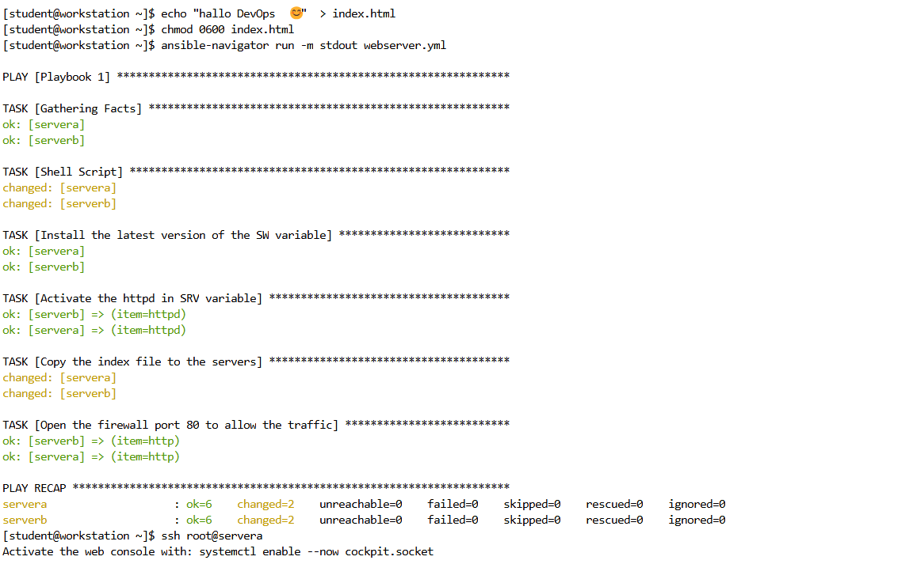
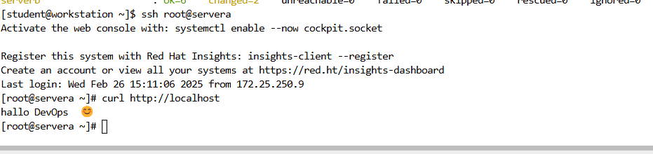

#  Lab 8: Ansible Playbooks for Web Server Configuration  
## Write an Ansible playbook to automate the configuration of a web server.


### 1- Create an inventory file (if not already done):
```
nano ~/inventory
```
#### 2- Add the managed hosts:
```
[web]
servera
serverb

[db]
serverc
serverd

[all:children]
web
db

[ws]
workstation

```
### Step 3: Create the Playbook
#### 1- Navigate to your Ansible directory:
```
cd ~
```
#### 2- Create a playbook file:
```
nano webserver.yml
```
#### 3- Add the following playbook content:
```
---
- name: Playbook 1
  hosts: web
  gather_facts: true
  vars:
    SW:
      - httpd
    SRV:
      - httpd
    PORTS:
      - http
  tasks:
    - name: Shell Script 
      shell: echo "Automated Script Started!"
    
    - name: Install the latest version of the SW variable
      dnf:
          name: "{{ SW }}"
          state: latest
    
  
    - name: Activate the httpd in SRV variable
      service:
        name: "{{ item }}"
        state: started
        enabled: true
      loop: "{{ SRV }}"

    - name: Copy the index file to the servers
      copy:
        src: /home/student/index.html
        dest: /var/www/html/
      ignore_errors: yes


    - name: Open the firewall port 80 to allow the traffic
      firewalld:
        service: "{{ item }}"
        state: enabled
        permanent: true
        immediate: true
      loop: "{{ PORTS }}"


```
### Step 4: Run the Playbook
#### 1- Execute the playbook:
```
ansible-navigator run -m stdout webserver.yml 
```


#### 2- Monitor the output for any errors.
### Step 5: Verify the Web Server
#### 1- On the managed host, check if the web server is running:
```
ssh root@servera
systemctl status httpd     
```
#### 2- Open a web browser and navigate to the IP address of the managed host:
```
curl http://localhost
```
You should see the message:
```
hallo DevOps  😊 
```


# Outcome
- The web server is installed, configured, and started on the managed host.
- The default web page (index.html) is deployed.
- HTTP traffic is allowed through the firewall, and the server is accessible over the network.
This playbook provides a reusable automation script for setting up web servers across multiple hosts.


